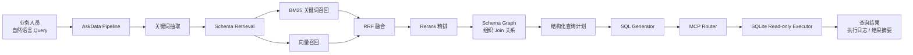

# AskData | 智能 BI / Text-to-SQL Agent

> 面向业务人员的自然语言取数原型：把一句自然语言 Query，经过 Schema 建模、混合检索、结构化查询计划、SQL 生成和只读工具执行，转化为可追踪、可验证的查询结果。

**项目定位：** AI 后端与智能体系统方向作品集
**核心关键词：** `Python` `RAG` `Schema Retrieval` `Text-to-SQL` `RRF` `Rerank` `MCP Router` `SQLite` `Milvus`

## 1. 项目概览

传统取数流程通常是：

```text
业务人员描述需求 -> 研发查表写 SQL -> 执行查询 -> 人工解释结果
```

AskData 将这条链路整理为可编排的查询工作流：

```text
自然语言 Query
    -> 关键词抽取
    -> 表 / 字段 / 指标 Schema 检索
    -> 关键词 + 向量混合召回
    -> RRF 融合 + Rerank 精排
    -> Schema Graph 组织 Join 关系
    -> 结构化查询计划
    -> SQL 生成
    -> MCP Router 只读执行
    -> 结果校验与结构化输出
```

这个项目的重点不是让模型直接“猜 SQL”，而是把模型放在受控的工程链路中：

| 模块 | 负责内容 |
| --- | --- |
| Schema 层 | 组织表、字段、指标口径和表关系 |
| 检索层 | 召回与当前问题真正相关的候选 Schema |
| 规划层 | 将自然语言拆成目标、数据、条件、指标 |
| 生成层 | 基于局部 Schema 生成 SQL |
| 工具层 | 统一执行 SQL，限制权限并记录结果 |
| 评估层 | 区分召回质量、SQL 可执行性和结果正确性 |

## 2. 端到端架构



## 3. 核心技术亮点

### 3.1 三级 Schema 建模

将数据库结构拆成三类可检索对象，避免把全量数据库结构一次性塞给模型：

```text
表级 Schema
  表名、表描述、主题域、主键、关联表

字段级 Schema
  字段名、字段类型、业务含义、所属表

指标级 Schema
  指标名称、计算口径、聚合方式、依赖字段
```

### 3.2 关键词与向量混合召回

关键词检索擅长字段名、缩写和精确术语；向量检索擅长自然语言语义相似度。两路候选经过 `RRF` 融合，再由 `Rerank` 做二次精排，减少相似字段和无关表进入 SQL 生成阶段。

```text
Query
  -> BM25 关键词召回
  -> Embedding 向量召回
  -> RRF 合并排名
  -> Rerank 精排
  -> 局部 Schema 上下文
```

### 3.3 结构化查询计划

查询规划层先把问题拆成结构化信息，再交给 SQL 生成器：

```text
Goal       要分析什么
Data       需要哪些表和字段
Condition  过滤条件与约束
Metric     聚合、计算和排序逻辑
```

这样做可以把“理解问题”和“编写 SQL”拆开，便于调试、记录和定位错误。

### 3.4 MCP Router 统一执行

模型不直接连接数据库。SQL 统一经过 MCP Router，再交给执行器：

```text
SQL
  -> 只允许 SELECT
  -> 执行前校验
  -> 统一超时与错误返回
  -> 记录执行请求和结果
  -> 返回结构化数据
```

## 4. 代码结构

```text
.
├── askdata_pipeline/       # 端到端流程编排与本地演示
├── schema_indexing/        # 表、字段、指标 Schema 索引构建
├── schema_retrieval/       # BM25、向量召回、RRF、Rerank、Schema Graph
├── cot_planning/            # 结构化查询计划
├── sql_generation/          # SQL Prompt、生成和解析
├── mcp_router/              # 只读 SQL 路由与 SQLite 执行
├── sql/                     # 本地演示数据库结构
├── tests/                   # 检索、生成、执行和端到端测试
├── requirements.txt
└── LICENSE
```

## 5. 本地运行

### 环境

- Python 3.10+
- Windows PowerShell、macOS 或 Linux 均可
- 默认使用本地 SQLite 演示库和 Mock 模型客户端
- 不配置 API Key 也可以先跑通核心流程

### 安装依赖

```bash
python -m venv .venv
```

Windows PowerShell：

```powershell
.\.venv\Scripts\Activate.ps1
pip install -r requirements.txt
```

macOS / Linux：

```bash
source .venv/bin/activate
pip install -r requirements.txt
```

### 运行端到端 Demo

```bash
python -m askdata_pipeline.end_to_end_demo
```

Demo 会自动创建本地演示库，并打印：

```text
用户 Query
Schema 检索关键词
Schema 图
结构化查询计划
局部 Schema
生成 SQL
MCP 执行请求
MCP 执行结果
```

### 运行测试

```bash
pytest -q
```

## 6. 公开版边界

本仓库是用于作品展示和技术面试的可运行原型：

- 示例数据仅用于本地演示，不连接真实企业数据库。
- 默认使用 SQLite 和 Mock 客户端，不包含 API Key、真实企业数据或模型权重。
- 重点展示 Schema 检索、查询规划、SQL 生成和只读执行链路。
- 多轮对话、生产级权限系统、分布式任务调度和大规模线上监控不属于当前公开 Demo 的实现范围。

## 7. 面试讲解主线

可以按下面的顺序介绍：

1. 先说明业务问题：业务人员会描述需求，但不一定会写 SQL。
2. 再说明 Schema 建模：把表、字段、指标和关联关系变成可检索知识。
3. 接着讲混合召回：关键词保证精确匹配，向量补充语义召回，RRF 和 Rerank 提升候选质量。
4. 然后讲查询规划和 SQL 生成：先形成结构化计划，再基于局部上下文生成 SQL。
5. 最后讲 MCP Router：模型只负责规划和生成，真正的执行、只读限制、错误处理和日志记录由工具层控制。

一句话总结：

> AskData 不是“把问题直接丢给大模型生成 SQL”，而是通过 Schema 检索、结构化规划和受控工具执行，把自然语言取数变成一条可调试、可评估、可扩展的 Agent 工作流。

## License

MIT
